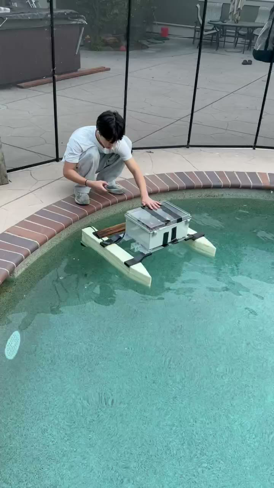

# Hardware documentation

Physical build documentation for the ASV v1 hull, propulsion, electronics,
and power system. For the software that runs on top of this hardware, see
[`docs/software/`](../software/README.md).

> **This documentation is a work in progress.** Sections marked `TODO` need
> specs filled in, and each subfolder lists the photos still needed --
> see [Photos needed](#photos-needed) below.

---

## System overview

```
                    ┌───────────────────────────┐
                    │        Hull / pontoons     │
                    │  (twin-pontoon catamaran)  │
                    └──────────────┬──────────────┘
                                   │ mounts
        ┌──────────────────────────┼──────────────────────────┐
        │                          │                          │
┌───────┴────────┐        ┌────────┴────────┐        ┌────────┴────────┐
│  Electronics    │  USB   │   Power system   │        │   Propulsion     │
│  enclosure:     │◄──────►│   battery,       │───────►│   2x ESC ->      │
│  ESP32 + Pi 4   │ serial │   distribution,  │  power │   2x ApisQueen   │
│                 │        │   switch/fuse    │        │   U2 Mini        │
└─────────────────┘        └──────────────────┘        └──────────────────┘
```

See [`docs/software/README.md`](../software/README.md) for the data/control
flow (app → Pi bridge → ESP32 → ESCs) layered on top of this physical
system.

## Subsystems

| Subsystem | Guide | Covers |
|---|---|---|
| Hull & pontoons | [`hull-and-pontoons/README.md`](hull-and-pontoons/README.md) | Hull material, dimensions, pontoon layout, mounting points |
| Propulsion | [`propulsion/README.md`](propulsion/README.md) | Thrusters, ESCs, mounting, wiring, **ESC calibration procedure** |
| Electronics | [`electronics/README.md`](electronics/README.md) | ESP32 + Raspberry Pi mounting, enclosure, USB/GPIO wiring |
| Power | [`power/README.md`](power/README.md) | Battery, power distribution, switches/fuses |

## Bill of materials

| Component | Spec | Notes |
|---|---|---|
| Hull | Foam-core, resin-coated pontoons, wood crossbar; pontoons 750mm long, 100x150mm cross-section, 700mm overall beam | Twin-pontoon catamaran layout, see [`hull-and-pontoons/README.md`](hull-and-pontoons/README.md) |
| Thrusters | 2x ApisQueen U2 Mini | See [`propulsion/README.md`](propulsion/README.md) |
| ESCs | 2x Diamond Hobby Python 20A, 2-4S LiPo input, integrated 5.5V/4A SBEC | Signal from ESP32 GPIO 25 (left), GPIO 26 (right) |
| Main controller | ESP32, TODO (exact board/module) | Reference-only firmware, see [`docs/software/esp32-firmware/README.md`](../software/esp32-firmware/README.md) |
| Bridge computer | Raspberry Pi 4, TODO (RAM size) | Runs `pi-bridge/`, connects to ESP32 via USB |
| Battery | Likely LiPo (inferred, not confirmed by label); voltage/capacity TODO | Charged with an iSDT smart charger; no onboard voltage/current telemetry installed yet |
| Wiring / connectors | XT60 (battery/ESC power), bare bullet connectors (thruster leads), a standalone "UBEC 5A" module in addition to each ESC's built-in SBEC | TODO confirm wire gauge and exact UBEC output spec |
| Enclosure | 3D-printed component cage (ESP32, battery, Pi on bottom; ESCs + switches on top) inside a latched dry-box, strapped to a wooden crossbar between the pontoons | Dry-box is for waterproofing only. See [`electronics/README.md`](electronics/README.md) -- TODO document dry-box exact make/model, IP rating |

Fill in the `TODO` fields as the build is finalized -- they're placeholders,
not guesses.

---

## Photos



Pool test: the fully assembled vessel, both pontoons joined by a wooden
crossbar, with the electronics enclosure mounted on top.


Floating unassisted -- side/rear view showing the waterproof enclosure
mounted on the crossbar between the two pontoons.

### Photos needed

- [x] ~~Full boat, front-on~~ -- see pool test launch photo above
- [x] ~~Full boat, side profile~~ -- see pool test floating photo above
- [ ] Full boat, top-down (both pontoons + electronics enclosure visible, out of water)

Each subsystem below has its own more specific list -- see the linked
README for exactly which close-ups are useful and where to save them.
