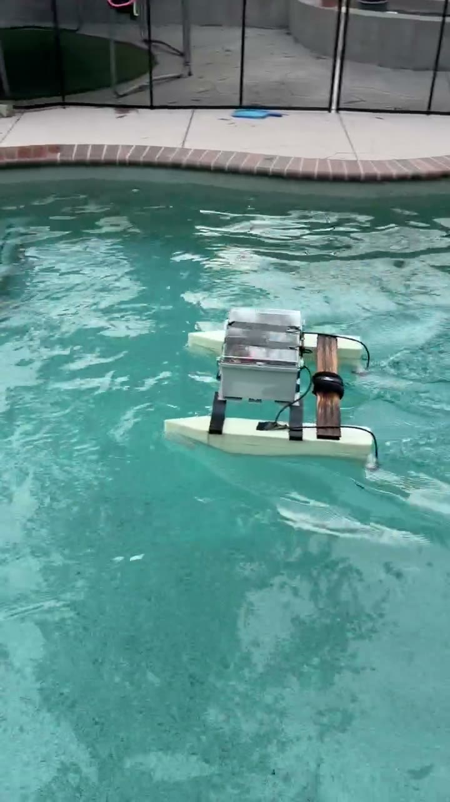
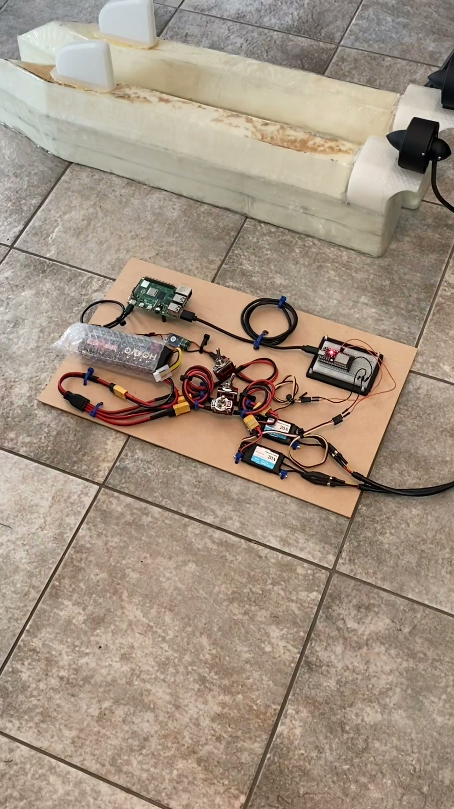

# Electronics: ESP32 & Raspberry Pi

The two compute boards that carry the control chain
(app → Pi → ESP32 → ESCs, see
[`docs/software/README.md`](../../software/README.md)).

## Boards

| | |
|---|---|
| Main controller | ESP32, TODO (exact board/module, e.g. ESP32-WROOM-32 devkit) |
| Bridge computer | Raspberry Pi 4, TODO (RAM size, model) |
| Connection | USB serial, `/dev/ttyUSB0` @ 115200 baud |
| ESP32 GPIO 25 | Left ESC signal (`esc1`) |
| ESP32 GPIO 26 | Right ESC signal (`esc2`) |

Opening the serial port from the Pi toggles DTR on most USB-serial
adapters, which resets the ESP32 and restarts its boot/arm sequence -- this
is expected behavior, not a fault. See
[`docs/software/esp32-firmware/README.md`](../../software/esp32-firmware/README.md)
for the full boot/arm timing.

## Enclosure

Two-part system: an inner 3D-printed "cage" that holds all the components,
which sits inside an outer waterproof box that exists purely for
waterproofing -- the cage itself is not watertight.

The outer waterproof box: latched, resting on the metal crossbeams that
bridge the two pontoons -- seen here closed and mounted during the pool
test. TODO: document exact box make/model, IP rating, and cable
entry/gland points.

The inner 3D-printed two-tier cage, photographed separately on the bench
(on a perforated aluminum stand used for the photo, not part of the final
boat mount) before going into the waterproof box above. Bottom tier: ESP32,
battery, and Raspberry Pi (only the Pi is clearly visible from this angle).
Top tier: both ESCs (Diamond Hobby Python 20A), 3 toggle switches, XT60
connectors for battery input, and a standalone UBEC module. See
[`docs/hardware/propulsion/README.md`](../propulsion/README.md) for the
ESCs and [`docs/hardware/power/README.md`](../power/README.md) for the
switches/connectors/UBEC shown here.

Full bench layout during development: Raspberry Pi, ESP32 on a breadboard,
battery pack, toggle switches, and both ESCs wired together on a cardboard
test board, with one pontoon visible in the background. Useful for seeing
how the ESP32 and Pi relate to each other before final mounting.

Close-up of the same bench setup: ESP32 dev board on a breadboard next to
a Raspberry Pi 4, with a battery pack and an iSDT smart charger in the
background. TODO: replace with a shot of this wiring inside the actual
mounted enclosure once finalized.

## Networking

The Pi hosts a WiFi hotspot the iOS app connects to directly (WebSocket,
port 8765). Hotspot setup (`hostapd`/`dnsmasq`) is a one-time OS
configuration step -- TODO: document the actual hotspot config used, or
link to it if kept elsewhere.

---

## Photos needed

Save to `docs/hardware/electronics/images/`:

- [x] `enclosure-mounted-exterior.jpg` -- enclosure as mounted on the boat, closed (pool test)
- [x] `enclosure-assembled.jpg` / `bench-layout-full.jpg` / `enclosure-interior-bench.jpg` -- bench wiring, pre-final-assembly
- [ ] `esp32-board.jpg` -- close-up of the ESP32 board/module itself, ideally as wired in the final enclosure
- [ ] `raspberry-pi-board.jpg` -- close-up of the Raspberry Pi as mounted in the final enclosure
- [ ] `usb-connection.jpg` -- the USB cable connecting Pi to ESP32
- [ ] `gpio-wiring.jpg` -- close-up of GPIO 25/26 wiring to the ESC signal leads
