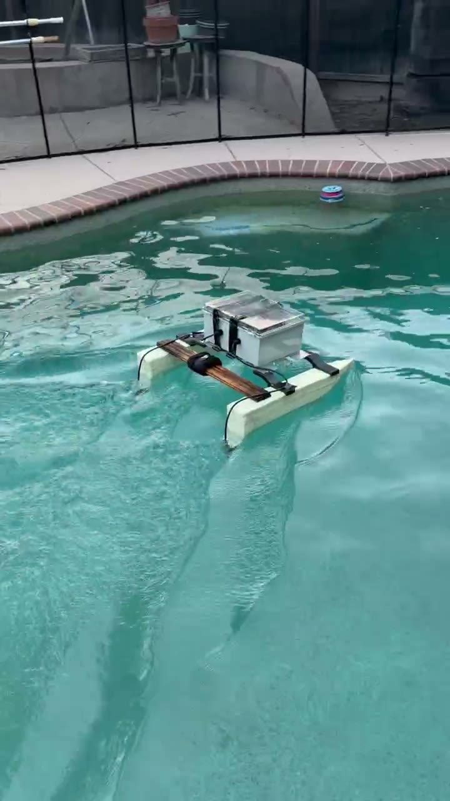

# Hull & pontoons

The vessel is a twin-pontoon catamaran hull, sized for waterway debris
collection.

## Specs

| | |
|---|---|
| Configuration | Twin-pontoon catamaran |
| Material | Rigid foam core (individual foam cells visible at the shaped/cut edges), coated with an amber resin skin for waterproofing -- exact foam type (XPS/EPS/other) and resin product still TODO |
| Pontoon length | 750mm |
| Pontoon cross-section | 100mm wide x 150mm tall |
| Gap between pontoons | 500mm (inner edge to inner edge) |
| Overall beam (width) | 700mm (100 + 500 + 100) |
| Approx. weight (dry, per pontoon) | ~6kg |
| Approx. weight (full vessel, assembled) | ~25kg |

Both pontoons, each with a thruster mounted at the stern end (connected via
a bullet-connector cable pair). Pontoon material is a rigid foam core with
a resin coating (see Specs above). The two white pods near the bow are
unidentified -- TODO document their purpose (antenna/GPS mounts?). The
e-bike in frame is for scale only, not part of the vessel.

## Mounting points

The two pontoons are bridged by a wooden crossbar/rail; the electronics
enclosure straps to that rail with what look like cable ties or hook-and-loop
straps (visible in the pool-test photo above). TODO: confirm crossbar
material/attachment method (screws/epoxy/lashing) and strap type. Thruster
mounting is documented in
[`docs/hardware/propulsion/README.md`](../propulsion/README.md).

## Debris collection mechanism

No scoop, net, or collection bay is visible in any of the available
photos (pontoons alone or the assembled pool test) -- TODO confirm
whether a collection mechanism exists yet or is planned as separate,
unbuilt hardware.

---

## Photos needed

Save to `docs/hardware/hull-and-pontoons/images/`:

- [x] `pontoons-with-thrusters.jpg` -- both pontoons with thrusters mounted at the stern
- [x] full assembled hull + crossbar -- see `../images/full-boat-pool-test-*.jpg` (embedded above)
- [ ] `hull-top-down.jpg` -- top-down view of both pontoons and the deck/crossbar, out of water
- [ ] `pontoon-cross-section.jpg` -- close-up of one pontoon's shape/attachment to the deck
- [ ] `mounting-points.jpg` -- close-up of the crossbar-to-pontoon attachment and enclosure straps
- [ ] `collection-mechanism.jpg` -- if applicable, the debris scoop/net/bay
