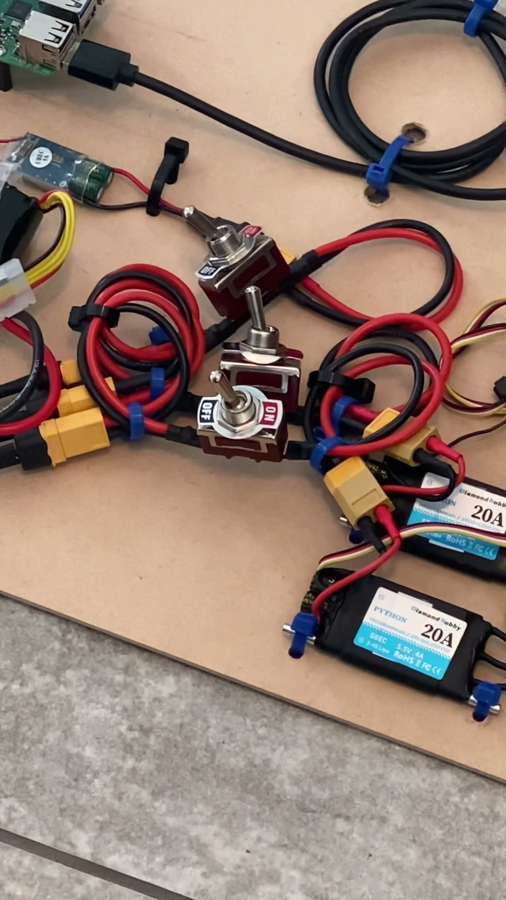
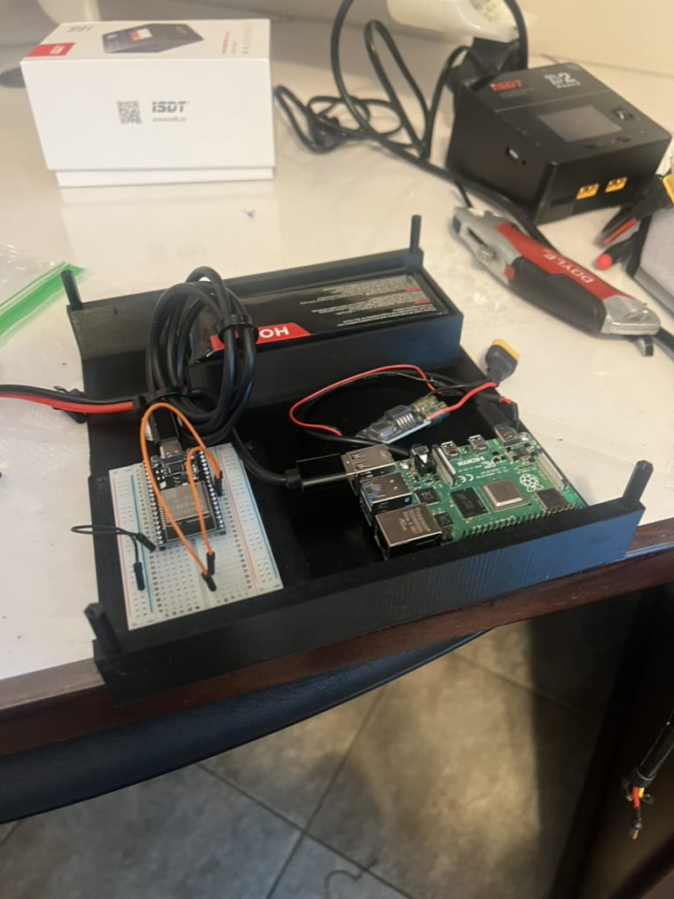

# Power system

Powers the ESP32, Raspberry Pi, and both ESCs/thrusters.

## Specs

| | |
|---|---|
| Battery chemistry | TODO (e.g. LiPo, LiFePO4, SLA) |
| Voltage | TODO |
| Capacity | TODO |
| Distribution | TODO (single bus vs. separate rails for logic vs. thrusters, BEC/regulator if any) |
| Switch / disconnect | TODO (main power switch or breaker location) |
| Fusing | TODO (fuse ratings and locations) |
| Charging | TODO (onboard vs. removable battery, connector type) |

Close-up of the switch/distribution wiring: 3 toggle switches, XT60
connectors, both ESCs (20A, one labeled "PYTHON"), and a small blue
board labeled "UBEC 5V" (a switching regulator, likely stepping battery
voltage down for the Pi/logic side) -- TODO confirm which toggle is main
power vs. arm/aux, and confirm the UBEC's role/output rating.

A battery pack (label mostly obscured) and an ISDT smart charger, shown
during bench setup rather than mounted on the boat -- TODO confirm battery
spec and photograph it in its actual mounted location.

**No voltage/current telemetry is installed yet.** The app's Drive screen
has a UI slot for battery level wired to a static mock value (see the
`TODO` comment in `app/src/state/useBoatStore.ts`) -- wiring in a real
sensor is future work, see
[`docs/software/README.md`](../../software/README.md#whats-stubbed--explicitly-out-of-scope).

## Safety

- Always have a way to cut power immediately (physical switch or unplugging
  the battery) -- this is required before doing any
  [ESC calibration](../propulsion/README.md#esc-calibration).
- TODO: note any low-voltage cutoff behavior, if the ESCs or a BMS provide one.

---

## Photos needed

Save to `docs/hardware/power/images/`:

- [x] `wiring-switches-escs-closeup.jpg` -- switches, ESCs, XT60 connectors, UBEC
- [x] battery + charger (bench, not mounted) -- see `../electronics/images/enclosure-interior-bench.jpg` (embedded above)
- [ ] `battery-mounted.jpg` -- battery in its actual mounting location on the boat
- [ ] `power-distribution.jpg` -- distribution block/terminal wiring to Pi, ESP32, and ESCs
- [ ] `fuses.jpg` -- fuse holder(s)/ratings, if present
- [ ] `charging-port.jpg` -- charging connector, if onboard charging is used
