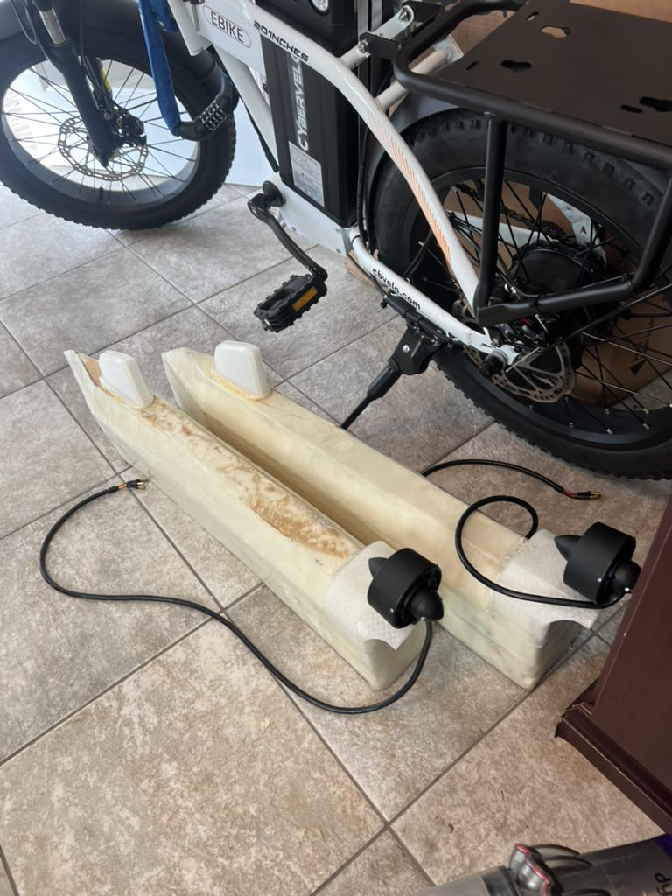
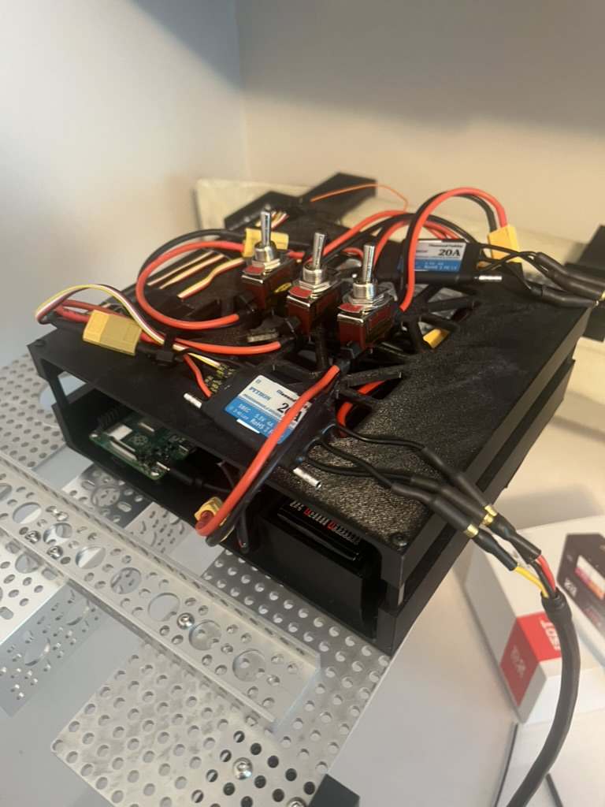

# Propulsion: thrusters & ESCs

Two independent thrusters, one per pontoon, each driven by its own ESC. The
ESP32 sends PWM directly to the ESCs -- see
[`docs/software/esp32-firmware/README.md`](../../software/esp32-firmware/README.md)
for the exact signal protocol.

## Thrusters

| | |
|---|---|
| Model | ApisQueen U2 Mini (x2) |
| Mounting | Pontoon-integrated: each thruster sits in a shaped recess molded/cut into the stern end of its pontoon's foam core, not a separate bracket -- see photo below. Exact attachment (adhesive/fasteners) still TODO. |
| Side | Left = port pontoon, Right = starboard pontoon -- TODO confirm (no bow/stern orientation reference in the photos) |
| Direction | Unconfirmed which thruster(s) need inverting. The app's Invert Left/Right toggles (Drive screen and Settings) exist specifically to correct this without touching firmware. |

## ESCs

| | |
|---|---|
| Model | Diamond Hobby Python 20A (x2) -- brand/model legible on both units' labels |
| Signal source | ESP32 GPIO 25 (left/`esc1`), GPIO 26 (right/`esc2`) |
| Signal range | 1000-2000us PWM, 1500us = neutral (uncalibrated default) |
| Input power | 2-4S LiPo (per the ESC's own printed spec) -- see [`docs/hardware/power/README.md`](../power/README.md) |
| Integrated BEC | Each ESC has a built-in SBEC rated 5.5V / 4A (its own label: "SBEC 5.5V 4A") |
| Mounting | Both ESCs sit in the top tier of the component cage -- see photo below |

Both thrusters mounted at the stern of each pontoon -- see
[`docs/hardware/hull-and-pontoons/README.md`](../hull-and-pontoons/README.md)
for the full pontoon photo.

Both ESCs mounted in the top tier of the inner component cage (the
3D-printed tray that sits inside the outer waterproof box), alongside the
power switches -- both are Diamond Hobby Python 20A units. See
[`docs/hardware/electronics/README.md`](../electronics/README.md) for the
full cage/enclosure explanation and photos.

---

## ESC calibration

`pi-bridge/config.json`'s `pwm_min` / `pwm_neutral` / `pwm_max` (1000 / 1500 /
2000 by default) are firmware placeholders, not calibrated values. Most
PWM-driven marine ESCs (including thrusters like the ApisQueen U2 Mini) need
a one-time throttle-range calibration so the ESC's own idea of min/neutral/max
matches what this system actually sends. The steps below are the standard
procedure for bidirectional RC-style ESCs -- **confirm against your specific
ESC/thruster's manual before running this**, since exact beep codes and
button sequences vary by manufacturer.

### Safety first

- Do this with the boat out of the water, thrusters clear of anything they
  could catch on or injure, and hands away from the propellers.
- Calibrate one ESC at a time.
- Have a way to cut power immediately (unplug the battery / a physical
  switch) -- don't rely on software to stop a miscalibrated ESC.

### Why this can't be done through the boat's normal boot sequence

Standard ESC calibration requires the ESC to see a **maximum** throttle
signal *before and during power-up*, then a **minimum** signal, so it learns
those two endpoints. `esp32-firmware/motor_controller.ino` (reference-only,
must not be modified) always writes neutral (1500us) a few seconds after its
own boot, before it can receive any serial command -- so there's no way to
have "max signal already present at ESC power-on" by going through the
Pi bridge and ESP32's normal startup. Calibration has to happen with the
ESC's signal wire driven directly by something else first.

### Generic calibration procedure

1. Disconnect the ESC's signal wire from the ESP32 and connect it instead to
   a servo tester, or a spare microcontroller running a throwaway sketch
   that just holds a fixed PWM value -- do not use the boat's ESP32 for
   this step.
2. With the ESC powered off, set the signal source to maximum (2000us).
3. Power on the ESC while it's receiving that max signal. Wait for its
   confirmation beep(s) (see the ESC's manual for what to expect).
4. Switch the signal source to minimum (1000us) and wait for the next
   confirmation beep(s).
5. Switch to neutral (1500us) and confirm the ESC beeps to indicate
   calibration is saved and it has armed at neutral.
6. Power off, reconnect the signal wire to the correct ESP32 GPIO (25 for
   left/`esc1`, 26 for right/`esc2` -- see
   [`docs/software/esp32-firmware/README.md`](../../software/esp32-firmware/README.md)),
   and repeat steps 1-5 for the other ESC.
7. Power the full system up normally (ESP32 → Pi bridge → app) and, before
   trusting it at any real throttle, verify neutral is genuinely "no thrust"
   on both sides using small joystick nudges on the Drive screen.

### After calibrating

If the ESC's actual min/neutral/max differ from the 1000/1500/2000 defaults,
update `pi-bridge/config.json` and the matching fields in the app's Settings
screen to the real values.

---

## Photos needed

Save to `docs/hardware/propulsion/images/`:

- [x] both thrusters mounted -- see `../hull-and-pontoons/images/pontoons-with-thrusters.jpg` (embedded above)
- [x] ESCs mounted -- see `../electronics/images/enclosure-assembled.jpg` (embedded above)
- [ ] `thruster-closeup.jpg` -- close-up of one ApisQueen U2 Mini (propeller/shaft/housing)
- [ ] `esc-wiring-signal.jpg` -- signal wire routing from ESP32 GPIO pins to the ESC
- [ ] `esc-wiring-power.jpg` -- ESC power leads back to the battery/distribution
